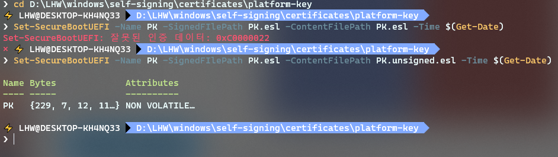
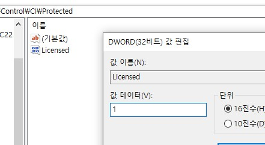

# Self-signing on Windows

This document assumes that those reading this document has basic expertises for shell and programming.
If you are not, you may try these, but it will be... painstaking.  
Translated from [original Korean document](https://lhwdev.github.io/note/other/windows-self-driver-signing)
I had written.
I changed my Windows locale to write this..

!!! warning "**Alert**"
    Get yourself informed enough.
    I do not guarantee if this would work.

!!! danger "🚧 **Under construction**"
    Going under translating
    [original Korean document](windows-self-driver-signing).

## Why?

I found Synchronous Audio Router(SAR) which can,

- add virtual audio device (UNLIMITED; as far as your Windows stands)
- FOSS
- just liked it
- high performance, low latency

So I made up mind to install it. However...

> ## Unsigned prereleased drivers note
> Prereleases of SAR are unsigned. That means that it is required to enable testsigning boot option
  to make Windows load the driver. Else the driver won't be loaded.

At this point I'd turned Secure Boot and gotta upgrade to Windows 11.
I also considered security, so turning on `testsigning` was not eligible.

At that time I came across [one issue](https://github.com/eiz/SynchronousAudioRouter/issues/86) saying:
> UPDATE 3: SUCCESS!!!!!!!!! I am running the latest SAR in Reaper as we speak on windows 10 without testmode.

(lhwdev was determined!)


## Get started

- Before you start, find ways to set **UEFI Platform Key** on your device. If your UEFI does
  not support this, you cannot do these all.
- This document covers a lot of dangerous things like 'setting UEFI Platform Key, editing EFI
  boot partition, modifying Windows system registry'. **Recommend backup in advance**.
  ~~(but the writer did not)~~

!!! info "**Reference**"
    If you want, take a look at that issue I began from, and
    [the issue referenced from there](https://github.com/valinet/ssde).

## Creating Certificates & Configuration
I used builtin powershell command `#!powershell New-SelfSignedCertificate` to create certificates
first, but I came to use OpenSSL. If you want, you can follow
[this one](https://github.com/HyperSine/Windows10-CustomKernelSigners/blob/master/asset/build-your-own-pki.md).

We are going to create certificates which is only valid on your device. (Virtual) Root Certificate
Authority, (Root CA) and create other certs using it.
I heard these methods work on Windows 11.

Launch Powershell with **admistrative privilege**. (not needed to create certs; needed after that)
This article is based on Powershell.

The resulting files are like this:
``` markdown
root-ca
- private.key
- cert-request.conf
- cert-request.csr
- cert.cer
- serial.srl
platform-key
- private.key
- cert-request.conf
- cert-request.csr
- cert.cer
- PK.unsigned.esl
- PK.esl
- PK.old.esl
kernel-mode
- private.key
- cert-request.conf
- cert-request.csr
- cert.cer
```

### Installing OpenSSL
OpenSSL is bundled when installing Git, so to use it check out
[this StackOverflow answer](https://stackoverflow.com/a/51757939/10744716).

Those with Chocolatey installed can use `#!powershell choco install openssl` in privileged shell.
Use `#!powershell refreshenv` to use new installed one without restarting shell. (bundled with choco)


### Creating Root CA Certificate

If the certificate of Root CA itself is trusted, certs that CA created will be trusted.

Create `root-ca` directory, and run the following.
``` powershell
cd root-ca

# Generate private key
openssl genrsa -aes256 -out private.key 2048
```
Demonstration of this is:

- `-aes256`: Encrypt the created private key. If you want to omit this you can, but it would be bad for
  security?
- `-out private.key`: Into the file 'private.key'.
- `2048`: The length of key.

Then copy-paste below and save to `cert-request.conf`, modifying what you want.
Do not modify things like countryName, (it does nothing) instead edit countryName_default,
for instance.

``` properties
[ req ]
default_bits = 2048
default_md = sha256
default_keyfile = private.key
distinguished_name = localhost_root_ca
extensions = v3_ca
req_extensions = v3_ca

[ v3_ca ]
basicConstraints = critical, CA:TRUE # , pathlen:0 # This option can adjust maximum number of 'intermediate CA'.
subjectKeyIdentifier = hash
keyUsage = keyCertSign, cRLSign

[ localhost_root_ca ]
countryName = Country Name (2 letter code)
countryName_default = 

organizationName = Organization Name (eg, company)
organizationName_default = Localhost # or what you want?

organizationalUnitName = Organizational Unit Name (eg, section)
organizationalUnitName_default  = 

commonName = "Common Name (eg, your name or your server's hostname)"
commonName_default = Localhost Root Certification Authority # or the name you want??
```

Return to shell, execute below to create Certificate Signing Request(CSR).

``` powershell
openssl req -new -key private.key -out cert-request.csr -config cert-request.conf
```

You will see below.
```
Enter pass phrase for private.key:
You are about to be asked to enter information that will be incorporated
into your certificate request.
What you are about to enter is what is called a Distinguished Name or a DN.
There are quite a few fields but you can leave some blank
For some fields there will be a default value,
If you enter '.', the field will be left blank.
-----
Country Name (2 letter code) []:
Organization Name (eg, company) [Localhost]:
Organizational Unit Name (eg, section) []:
Common Name (eg, your name or your server's hostname) [Localhost Root Certification Authority]:
```
Enter the password (if you set), press enter repeatedly as we set default values in `cert-request.conf`.

Now you can see `cert-request.csr`. Create actual cert with command below.
```powershell
openssl x509 -req -days 18250 -extensions v3_ca `
  -in cert-request.csr -signkey private.key `
  -out cert.cer -extfile cert-request.conf
```

- Replace 18250 in `-days 18250` with the duration you want the cert to be valid. Note that 18250 equals to
  approximately 50 years. (or 365 * 50)
- `-extensions v3_ca` loads `[ v3_ca ]` part from .conf file you'd written.
- The left are file names.


Now you need to register `cert.cer` to Windows so that it is trusted.
Double click the cert created from above, `cert.cer`, and 'Install certificate...' >
'Local Machine' > 'Place all certificates in the following store', 'Browse... >
'Trusted Root Certification Authorities'. Now if you open your cert, it will be shown
as valid.


Now let's create **UEFI Platform Key Certificate** and **Kernel Mode Driver Certificate**.


### Creating UEFI Platform Key(PK) Certificate
Move to the root directory we started, new folder 'platform-key', and run below.

``` powershell
cd ../platform-key

# Generate personal key
openssl genrsa -aes256 -out private.key 2048
```

After, new file `cert-request.conf` and copy-paste, once more.

``` properties
[ req ]
default_bits = 2048
default_md = sha256
default_keyfile = private.key
distinguished_name = localhost_uefi_platform_key
extensions = v3_req

[ v3_req ]
basicConstraints = CA:FALSE
authorityKeyIdentifier = keyid, issuer
subjectKeyIdentifier = hash
keyUsage = digitalSignature

[ localhost_uefi_platform_key ]
countryName = Country Name (2 letter code)
countryName_default = 

organizationName = Organization Name (eg, company)
organizationName_default = Localhost

organizationalUnitName = Organizational Unit Name (eg, section)
organizationalUnitName_default  = 

commonName = "Common Name (eg, your name or your server's hostname)"
commonName_default = Localhost UEFI Platform Key Certificate
```

Create CSR file.
``` powershell
openssl req -new -key private.key -out cert-request.csr -config cert-request.conf
```
Enter the password and press enterrrrrr again.

Let's make the certificate.
``` powershell
openssl x509 -req -days 18250 -extensions v3_req `
  -in cert-request.csr `
  -CA ../root-ca/cert.cer -CAcreateserial -CAserial ../root-ca/serial.srl `
  -CAkey ../root-ca/private.key `
  -extfile cert-request.conf -out cert.cer
```

- `-CA ...`: path to CA certificate (public key)
- `-CAkey ...`: same (but private key)
- `-CAcreateserial -CAserial ../root-ca/serial.srl`: Create serial file and save to serial.srl.
  This file let certificates made using CA never have serial numbers colliding.
  If serial.srl file already exists, you should exclude `-CAcreateserial` option.

Additionally you should convert private.key to .pfx file as it is used from signtool to sign
'Si Policy'.

``` powershell
openssl pkcs12 -export -out private.pfx -inkey private.key -in cert.cer
```


### Setting Platform Key of UEFI Firmware

*<p align="center">Cool</p>*

There are different ways depending on your device. My computer was Dell laptop, where there is
'Export Key Management', but it didn't work.  
But I got it work by using powershell command `#!powreshell Set-SecureBootUefi`.

If you want to set PK after generating all the keys you can, but you might feel sense of lose(?)
if your UEFI do not allow you to set PK.

Check your UEFI setting first and try it if exists.

In the method below using powershell, I used `efitools` through [WSL](https://docs.microsoft.com/windows/wsl/about). (but that command has some parameter like `-Hash`? I didn't try it)
In fact I couldn't find alternative for efitools, so if you find one, PR this document.

**Before trying methods below, change Secure Boot Mode in UEFI configuration.** Changing keys like
PK is blocked by default. For me, (Dell laptop) there were 'Deploy Mode' and 'Audit Mode'. Setting
it to 'Audit Mode' worked.

Get into WSL terminal.

``` bash
# Move to platform-key directory
cd $(wslpath "path to platform-key/")

# generate esl file
cert-to-efi-sig-list -g "$(cat /proc/sys/kernel/random/uuid)" cert.cer PK.unsigned.esl

# sign esl file
sign-efi-sig-list -k private.key -c cert.cer PK PK.unsigned.esl PK.esl
```
Note that .esl stands for EFI Signature List, which is a format to store signatures in UEFI firmware.

Backup esl file in advance, just in case.
``` powershell
Get-SecureBootUefi -Name PK -OutputFilePath PK.old.esl
```

Then open powershell with **administrative privilege**, (don't need to reopen if you are with) move
to platform-key directory, and enter below.

``` powershell
Set-SecureBootUEFI -Name PK -SignedFilePath PK.esl -ContentFilePath PK.unsigned.esl -Time $(Get-Date)
```

If `Set-SecureBootUEFI: Invalid certification data: 0xC0000022` shows, you may put wrong key, not
change Secure Boot Mode, or your UEFI may not support it.  
If you see something like below, congratulations. Our UEFI will trust our CA.

```
Name Bytes                Attributes
---- -----                ----------
PK   {161, 89, 192, 18…} NON VOLATILE…
```


### 커널 모드 드라이버 인증서 만들기
New directory kernel-mode-driver from root, run this.

``` powershell
cd ../kernel-mode-driver

# generate personal key
openssl genrsa -aes256 -out private.key 2048
```

Create `cert-request.conf` here again like this:

``` properties
[ req ]
default_bits = 2048
default_md = sha256
default_keyfile = private.key
distinguished_name = localhost_kernel_mode_driver
extensions = v3_req

[ v3_req ]
basicConstraints = CA:FALSE
authorityKeyIdentifier = keyid, issuer
subjectKeyIdentifier = hash
keyUsage = digitalSignature
extendedKeyUsage = codeSigning

[ localhost_kernel_mode_driver ]
countryName = Country Name (2 letter code)
countryName_default = 

organizationName = Organization Name (eg, company)
organizationName_default = Localhost

organizationalUnitName = Organizational Unit Name (eg, section)
organizationalUnitName_default  = 

commonName = "Common Name (eg, your name or your server's hostname)"
commonName_default = Localhost Kernel Mode Driver Certificate
```

Create CSR file.
``` powershell
openssl req -new -key private.key -out cert-request.csr -config cert-request.conf
```
Enter password, press enter a few times.

Create certificate.
``` powershell
openssl x509 -req -days 18250 -extensions v3_req `
  -in cert-request.csr `
  -CA ../root-ca/cert.cer -CAserial ../root-ca/serial.srl `
  -CAkey ../root-ca/private.key `
  -extfile cert-request.conf -out cert.cer
```

Again, need to convert private.key into .pfx file.

``` powershell
openssl pkcs12 -export -out private.pfx -inkey private.key -in cert.cer
```

We made all three certificates needed. (we could combine all into one, but that
would be inflexible and less secure? maybe?)


## Setting Signing Policy (Si Policy)
We had to create xml file containing signing policy then convert into binary
file, but this only works in Windows Enterprise/Education Edition. So
[Download prebuild binary file.](https://www.geoffchappell.com/notes/windows/license/_download/sipolicy.zip)

Now sign `selfsign.bin` so that Windows recognizes it.

``` powershell
signtool sign /fd sha256 /p7co 1.3.6.1.4.1.311.79.1 /p7 . /f platform-key/private.key /p <# password for platform-key #> sipolicy/selfsign.bin
```

- `sipolicy/selfsign.bin`: the file you downloaded right before

Now you will see `selfsign.bin.p7` file. Rename it into `SiPolicy.p7b`. Open powershell with administrative privilege, (don't need to reopen if you are with) enter command:

``` powershell
# Mount EFI system partition on X: drive (dangerous!)
mountvol x: /s

# Copy SiPolicy
cp SiPolicy.p7b X:\EFI\Microsoft\Boot\

# unmount EFI volume
mountvol x: /d
```

## Turning on Custom Kernel Signer(CKS)
This value called 'CodeIntegrity-AllowConfigurablePolicy-CustomKernelSigners' is stored in
`HKLM\SYSTEM\CurrentControlSet\Control\ProductOptions` in registry. This value can be virtually
set when kernel initialization is not finished. See
[original documentation for more detail](https://github.com/HyperSine/Windows10-CustomKernelSigners).

[Download ssde.zip from here](https://github.com/valinet/ssde/releases).
There is ssde.sys inside. We will sign this driver.

``` powershell
signtool sign /fd sha256 /a /ac root-ca/cert.cer /f kernel-mode-driver/private.pfx /p <# password #> /tr http://sha256timestamp.ws.symantec.com/sha256/timestamp ssde.sys
```

After running commands below, Windows recognizes some system driver is signed with unknown driver.
(as we didn't configure some Code Integrity related values) So causing kernel fault. You will enter
the recovery mode, known as WinRE, meaning you CANNOT BOOT until you change something.

Those who fears a lot can configure WinPE(Windows Preinstalled Environment), but you may manually
enter WinRE from UEFI, maybe? If you want check in advance. ~~but the authod didn't~~  
To check if WinRE is available, run below.
``` powershell
reagentc /info
```
If Windows RE status is `Enabled`, it will likely work. If not, you need to enable it by
`#!powershell reagentc /enable`.

Install the ssde.sys **signed above** by running command below in administrative privilege.
(If you are in cmd, change `#!powershell $env:windir` to `#!bat %windir%`.)

``` powershell
cp ssde.sys $env:windir\system32\drivers\ssde.sys
sc create ssde binpath=$env:windir\system32\drivers\ssde.sys type=kernel start=boot error=normal
```

**To revert this**, you can just delete that driver in command prompt in recovery mode, like
`#!bat del /F C:\Windows\System32\drivers\ssde.sys`. If you turn off Secure Boot even after you
succeeded all steps, PK is reset, so Windows won't recognize `ssde.sys` and you will be brought to
recovery mode.

**Watch following contents in your phone or write down in advance.**  
Reboot your computer, and it will show different like 'Preparing Auto Repair'. This means booting
failed and implies kernel panic.

> Your PC did not start correctly

Click **Advanced options**, then **Troubleshoot > Advanced options > Command Prompt**.
Select your account and enter password. It will show a command prompt. Enter `#!bat regedit` to
enter Registry Editor.
Select `HKEY_LOCAL_MACHINE`, go to `File(F)` > `Load hive(L)...` then open
`C:\Windows\System32\config\SYSTEM`, enter any name, (doesn't matter) then you will see '(any name)'
under `HKEY_LOCAL_MACHINE`. select `ControlSet001\Control\CI\Protected` **under (any name)**, change
the value **`Licensed` from `0` to `1`**.



Like this.

We finished what we have to do. Close all windows and reboot, and it will start normally.
Now start `ssde_info.exe` (from ssde.zip we've downloaded somewhere above) from shell.
If it shows thingy like this:

```
API version is 1.1
Arm count is 2
Arm watchdog status is 1
License tamper state is 0
```

than you would likely have succeeded, as this driver was signed with our cert.

Now if you restart your computer and check if it boots normally. If it does, we finished configuring
self signing. Congratulations.

If you want revert Secure Boot Mode from UEFI settings. (which was needed to set PK)


## Reference
This document is based on ssde. Some references are:

- [Stable method: valinet/ssde](https://github.com/valinet/ssde)
- [First working PoC: HyperSine/Windows10-CustomKernelSigners](https://github.com/HyperSine/Windows10-CustomKernelSigners)
- [Original PoC: Licensed Driver Signing in Windows 10](https://www.geoffchappell.com/notes/windows/license/customkernelsigners.htm)

Some useful documents:

- [Articles about UEFI Secure Boot from U.S. Defense](https://media.defense.gov/2020/Sep/15/2002497594/-1/-1/0/CTR-UEFI-Secure-Boot-Customization-UOO168873-20.PDF)
