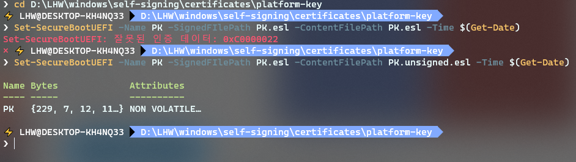

# 윈도우에서 직접 드라이버 서명하기


!!! warning "**안내**"
    이 글을 따라하기 전에 충분히 찾아보고 하세요.
    필자는 어떤 문제도 보장하지 않습니다.

!!! warning "**작성 중**"
    이 글은 아직 완성되지 않았어요.
    사실 그 이유는 지금 저 짓을 하고 있어서...
    나중에 성공하면 스크립트로도 만들어서 배포할게요

## 왜?
내가 온라인 수업을 하면서 마이크로 장난(...)을 좀 쳐보고 싶어졌습니다. 그리고 평소에 음악을 들을 때
FL 같은 DAW로 소리를 직접 보정해서 들었는데, 오디오 스펙트럼을 보면 좀 간지나기 때문에...

아무튼 이러한 짓거리에는 필수적으로 필요했던 게 바로 가상 오디오 장치였는데 이미 나와있는 것들은
아래와 같았고 모두 만족스럽지 않았어요.

- **VB Audio Cable**  
  무료 체험판의 경우 케이블 1개만 사용 가능.
  `온라인 수업을 하며 마이크로 장난`과 `음악 보정` 둘 다 하려면 케이블이 적어도 2개는 있어야 했다.

- **ODeus ASIO Link Pro**  
  ... 그냥 이거 쓸까?  
  디자인이 마음에 안들었다.

- **Virtual Audio Cable**  
  엄청 좋아보이는데 유료임.

그러다가 Synchronous Audio Router(SAR)이라는 프로그램을 발견했어요. 사실 오디오를 라우팅하거나 보정하는 거는 FL로 하면 되기
때문에 전혀 문제가 되지 않았습니다. SAR은

- 동적으로 가상 오디오 장치 추가 (무제한! 그냥 윈도우가 버텨주는 한 계속 만들 수 있음)
- 무료, 오픈소스임
- 그냥 마음에 듦
- 성능이 좋은 편임

이러했고, 그래서 SAR을 설치하기로 마음을 먹었는데...

> ## Unsigned prereleased drivers note
> Prereleases of SAR are unsigned. That means that it is required to enable testsigning boot option
  to make Windows load the driver. Else the driver won't be loaded.

이 시점에, 나는 UEFI 설정에서 Secure Boot를 켜놨었고 곧 윈도우 11로 업그레이드할 계획이었습니다.
그리고 보안을 고려하기도 했기 때문에 `testsigning` 부트 설정을 켜는 건 가능한 선택이 아니었습니다.

그러다가 [어느 한 이슈](https://github.com/eiz/SynchronousAudioRouter/issues/86)를 보게 되었는데
> UPDATE 3: SUCCESS!!!!!!!!! I am running the latest SAR in Reaper as we speak on windows 10 without testmode.

어떤 사람이 성공했다고 해요. 그래서 저도 해보기로 했답니다. ㅋㅋㅋㅋㅋㅋㅋㅋ
벌써부터 험난해보이는...


## 본격적으로 시작!
내가 참조한 문서들은 저기 말한 '어느 한 이슈'에 설명되어 있는 방법을 (아주 많이) 변형해서 OpenSSL을 쓴
방법이었어요. 설명이 아주 불친절하더라고요.
실제로 불친절한지는 모르겠지만 (하지만 `its confusing and you have to jump back and forth between his guide and an older one` 라는 말이 있었다만)
내가 한국인이란 점을 감안하면..

시작하기 전에 자신의 기기에서 **UEFI 플랫폼 키**를 설정하는 방법이 있는지, 어떻게 하는지를 미리
알아보기를 권장합니다. UEFI가 지원하지 않는다면 이걸 할 수가 없습니다.

!!! info "**참고**"
    일단 이걸 하기 전에 위에 참조한 이슈랑
    [거기서 참조하는 이 리포](https://github.com/valinet/ssde)는 한번 훑어보시는 걸 추천드립니다.

## 인증서 만들기 / 설정
인증서를 만드는 방법은 [이 문서에 잘 설명되어 있습니다](https://github.com/HyperSine/Windows10-CustomKernelSigners/blob/master/asset/build-your-own-pki.md).
하지만 저 방법대로 했더니 내 UEFI(Dell임)가 인증서를 뱉길래 OpenSSL을 써서 다시 시도해보았습니다.
(이제와서 보니 다시 시도할 필요가 있는지는 의문이지만...)

우리가 할 것은 이 기기에서 작동하는 인증서를 만드는 것인데, 이 기기에서만 작동하는 '가상의 인증서 키
발급 기관' 같은 걸 만든 다음 그 기관의 인증서를 이용해서 **UEFI 플랫폼 키 인증서**와
**커널 모드 드라이버 인증서**를 만들 것입니다.
참고로 윈도우 11에서도 잘 된다고 합니다.

파워셸을 **관리자 권한으로 실행해주세요.** (인증서 만들 때까지는 필요없는데 그 이후에 필요한 작업이
몇 개 있습니다.)
이 글은 파워셸을 기준으로 설명합니다. cmd라면 알아서 바꾸시길... (예를 들어 줄 끝에 `\` `가 있다면
그걸 지우고 다음줄과 합치면 된다.)

아래의 지시사항을 다 따른다면 아래와 같은 파일 구조가 만들어집니다.
``` markdown
root-ca
- private.key
- cert-request.conf
- cert-request.csr
- cert.cer
- serial.srl
platform-key
- private.key
- cert-request.conf
- cert-request.csr
- cert.cer
- PK.unsigned.esl
- PK.esl
- PK.old.esl
kernel-mode
- private.key
- cert-request.conf
- cert-request.csr
- cert.cer
```

### OpenSSL 설치
깃을 설치할 때 기본값으로 OpenSSL이 번들되어 있는데, 그걸 쓰고싶다면
[이 StackOverflow 답변](https://stackoverflow.com/a/51757939/10744716)을 참고하세요.

저는 걍 깔고 싶어서 걍 깔았어요.
Chocolatey가 깔려있는 사람이라면 관리자 권한 셸에서 `#!powershell choco install openssl`을 치기만 하면
됩니다. 터미널을 껐다 켜기 싫으면 `#!powershell refreshenv`만 치면 돼요.


### '인증서 발급 기관' (Root CA Certificate) 생성
어떤 Root CA 자체의 인증서가 신뢰된다면 그 CA가 발급한 다른 인증서도 마천가지로 신뢰될 것입니다.
예를 들어 WIZVERA라는 CA 인증기관을 믿을 수 있다면, 그 인증기관에서 발급한 인증서도 믿을 수 있는데요,
그래서 우리가 HTTPS 서명을 만들려면 어떤 인증서 발급기관에서 돈을 주고(물론 무료도 있지만) 인증서를
발급받는 것이에요.


`root-ca` 폴더를 만들고 아래 명령어를 실행하세요.
``` powershell
cd root-ca

# 비공개 키 생성하기
openssl genrsa -aes256 -out private.key 2048
```
이 명령어를 설명해보자면,

- `-aes256`: 생성되는 비공개 키를 암호화해서 보관함. 즉 암호를 암호화하는 옵션인 것. 비밀번호를
  입력하는 게 귀찮다면 생략해도 되긴 한데 가능하면 설정하는 게 좋아요.
- `-out private.key`: 'private.key'라는 파일로 내보냄.
- `2048`: 키의 길이를 2048비트로.


그 다음, 아래 내용을 복붙한 후 원하는 내용은 수정하고 `cert-request.conf`이라는 이름으로 저장하세요.
countryName같은 것들은 수정하거나 지우지 말고, 대신 countryName_default같은 걸 수정하면 됩니다.
``` properties
[ req ]
default_bits = 2048
default_md = sha256
default_keyfile = private.key
distinguished_name = localhost_root_ca
extensions = v3_ca
req_extensions = v3_ca

[ v3_ca ]
basicConstraints = critical, CA:TRUE # , pathlen:0 # 이 옵션은 '중간 CA'의 최대 개수를 조절할 수 있다.
subjectKeyIdentifier = hash
keyUsage = keyCertSign, cRLSign

[ localhost_root_ca ]
countryName = Country Name (2 letter code)
countryName_default = 

# 기관
organizationName = Organization Name (eg, company)
organizationName_default = Localhost

# 기관 부서
organizationalUnitName = Organizational Unit Name (eg, section)
organizationalUnitName_default  = 

# 이 인증서의 이름
commonName = "Common Name (eg, your name or your server's hostname)"
commonName_default = Localhost Root Certification Authority
```

터미널로 돌아와서 아래 명령어를 입력해서 인증서 요청 파일(CSR)을 만들으세요.
``` powershell
openssl req -new -key private.key -out cert-request.csr -config cert-request.conf
```

아래처럼 뜰 것입니다.
```
Enter pass phrase for private.key:
You are about to be asked to enter information that will be incorporated
into your certificate request.
What you are about to enter is what is called a Distinguished Name or a DN.
There are quite a few fields but you can leave some blank
For some fields there will be a default value,
If you enter '.', the field will be left blank.
-----
Country Name (2 letter code) []:
Organization Name (eg, company) [Localhost]:
Organizational Unit Name (eg, section) []:
Common Name (eg, your name or your server's hostname) [Localhost Root Certification Authority]:
```
비밀번호를 입력하고, 나머지는 `cert-request.conf` 파일에서 설정했기 때문에 엔터를 연타해주면 자동으로 넘어갑니다.

그럼 `cert-request.csr` 파일이 생겼을 것입니다. 아래의 명령어로 실제 인증서를 만들어줍니다.
```powershell
openssl x509 -req -days 18250 -extensions v3_ca `
  -in cert-request.csr -signkey private.key `
  -out cert.cer -extfile cert-request.conf
```

- `-days 18250`에서 18250을 원하는 날짜로 수정해주면 됩니다. 18250일은 약 50년입니다. (정확하게는 365 * 50)
- `-extensions v3_ca`는 cert-request.conf에서 `[ v3_ca ]`라는 부분에서 정보를 불러오도록 해줍니다
- 나머지는 다 파일이름을 넣어주는 것입니다.


이제 나온 `cert.cer` 파일을 윈도우에 박아줘야 합니다. 이 인증서를 더블클릭해서 열고 '인증서 설치' > 저장소 위치를
'로컬 컴퓨터'로 > '모든 인증서를 다음 저장소에 저장'에서 '찾아보기'의 '신뢰할 수 있는 루트 인증 기관(Trusted Root
Certification Authority)'를 선택하고 설치하면 됩니다.


이제 **UEFI 플랫폼 키 인증서**와 **커널 모드 드라이버 인증서**를 만들어봅시다.


### UEFI 플랫폼 키 인증서 인증서 만들기
상위 폴더에서 platform-key 폴더를 만들고 아래 코드를 실행합니다.

``` powershell
cd ../platform-key

# 개인키 생성
openssl genrsa -aes256 -out private.key 2048
```

그 다음, 또 다시 이 폴더에 `cert-request.conf`를 만들고 복붙하세요.

``` properties
[ req ]
default_bits = 2048
default_md = sha256
default_keyfile = private.key
distinguished_name = localhost_uefi_platform_key
extensions = v3_req

[ v3_req ]
basicConstraints = CA:FALSE
authorityKeyIdentifier = keyid, issuer
subjectKeyIdentifier = hash
keyUsage = digitalSignature

[ localhost_uefi_platform_key ]
countryName = Country Name (2 letter code)
countryName_default = 

# 기관
organizationName = Organization Name (eg, company)
organizationName_default = Localhost

# 기관 부서
organizationalUnitName = Organizational Unit Name (eg, section)
organizationalUnitName_default  = 

# 이 인증서의 이름
commonName = "Common Name (eg, your name or your server's hostname)"
commonName_default = Localhost UEFI Platform Key Certificate
```

아래 명령어로 인증서 발급 요청(CSR) 파일을 만듭니다.
``` powershell
openssl req -new -key private.key -out cert-request.csr -config cert-request.conf
```
마천가지로 비번을 입력하고, 엔터를 연타해줍니다.

이제 인증서를 만들도록 하겠습니다.
``` powershell
openssl x509 -req -days 18250 -extensions v3_req `
  -in cert-request.csr `
  -CA ../root-ca/cert.cer -CAcreateserial -CAserial ../root-ca/serial.srl `
  -CAkey ../root-ca/private.key `
  -extfile cert-request.conf -out cert.cer
```

- `-CA ...`: CA 인증서의 경로
- `-CAkey ...`: CA 비공개 키의 경로
- `-CAcreateserial -CAserial ../root-ca/serial.srl`: serial 파일을 만들고 serial.srl 파일에
  저장. 이 루트 인증서로 만드는 인증서들의 시리얼 넘버가 겹치지 않게 해줍니다.
  만약 이 명령어를 여러번 실행할 때에는 serial.srl 파일이 이미 있기 때문에 `-CAcreateserial`은 빼야 합니다.

추가로, 나중에 윈도우 드라이버나 'Si Policy'를 서명할 때 필요하기 때문에(signtool을 쓰기 위해) private.key를
.pfx 파일로 변환해줘야 합니다.

``` powershell
openssl pkcs12 -export -out private.pfx -inkey private.key -in cert.cer
```


### UEFI 펌웨어의 플랫폼 키(PK) 설정

*<p align="center">지린다</p>*

여기서는 본인의 컴퓨터마다 쓸 수 있는 방법이 상이합니다. 저의 경우 Dell 노트북이었는데, UEFI 설정에
'Expert Key Management'라는 PK를 설정할 수 있는 곳이 있었는데 결론적으로는 아주 잘 작동하지 않았습니다.
무언가가 심하게 고장난 듯? 하지만! 파워셸 명령어인 `#!powreshell Set-SecureBootUefi`을 써서
작동하게 했습니다.

일단 한번에 키를 다 만들어놓고 이걸 하고 싶다면 아래 문단 '커널 모드 드라이버 인증서 만들기'를 먼저 해도
됩니다. 다만 다 만들어놓고 설정을 못한다면 상실감이 클테니 이걸 먼저 하는 것을 권장합니다.

우선 본인 UEFI 설정에서 이걸 정하는 기능이 있는지 확인해보고, 있다면 그 방법을 시도해보세요.  
이 방법도 UEFI에 따라 될 수도, 안될 수도 있습니다.

필자는 [WSL](https://docs.microsoft.com/windows/wsl/about)을 통해 `efitools`를 설치해서 했습니다.
사실 저 efitools의 윈도우용 대안을 찾지 못해서 이렇게 한 것인데. 만약 대안을 찾았다면 이 문서에 PR 좀...

일단 WSL 터미널로 들어갑니다.

``` bash
# platform-key 폴더로 이동
cd $(wslpath "platform-key 폴더의 경로")

# esl 파일 생성
cert-to-efi-sig-list -g "$(cat /proc/sys/kernel/random/uuid)" cert.cer PK.unsigned.esl

# esl 파일 서명
sign-efi-sig-list -k private.key -c cert.cer PK PK.unsigned.esl PK.esl
```
참고로 .esl 파일은 EFI Signature List의 약자로, UEFI 펌웨어에서 서명을 저장하는 방식의 일부입니다.
esl 파일을 서명하면 보안이 더 좋으려나?

설정하기 전에 esl 파일을 백업합시다.
``` powershell
Get-SecureBootUefi -Name PK -OutputFilePath PK.old.esl
```

그 다음 **관리자 권한으로** 파워셸을 열고(이미 관리자 권한이면 새로 열지 않아도 됩니다.) platform-key
폴더로 이동한 후 아래 명령어를 입력합니다.

``` powershell
Set-SecureBootUEFI -Name PK -SignedFilePath PK.esl -ContentFilePath PK.unsigned.esl -Time $(Get-Date)
```

만약 `Set-SecureBootUEFI: 잘못된 인증 데이터: 0xC0000022`라고 뜬다면 키를 잘못 넣어줬거나 UEFI가
지원하지 않는 것입니다.  
만약 성공했다면, 축하합니다. 이제 컴퓨터의 UEFI는 우리의 인증서 발급 기관(CA)을 신뢰할 거에요.


### 커널 모드 드라이버 인증서 만들기
상위 폴더에서 kernel-mode-driver 폴더를 만들고 아래 코드를 실행합니다.

``` powershell
cd ../kernel-mode-driver

# 개인키 생성
openssl genrsa -aes256 -out private.key 2048
```

그 다음, 또또 다시 이 폴더에 `cert-request.conf`를 만들고 복붙 ㄱㄱ

``` properties
[ req ]
default_bits = 2048
default_md = sha256
default_keyfile = private.key
distinguished_name = localhost_kernel_mode_driver
extensions = v3_req

[ v3_req ]
basicConstraints = CA:FALSE
authorityKeyIdentifier = keyid, issuer
subjectKeyIdentifier = hash
keyUsage = digitalSignature
extendedKeyUsage = codeSigning

[ localhost_kernel_mode_driver ]
countryName = Country Name (2 letter code)
countryName_default = 

# 기관
organizationName = Organization Name (eg, company)
organizationName_default = Localhost

# 기관 부서
organizationalUnitName = Organizational Unit Name (eg, section)
organizationalUnitName_default  = 

# 이 인증서의 이름
commonName = "Common Name (eg, your name or your server's hostname)"
commonName_default = Localhost Kernel Mode Driver Certificate
```

아래 명령어로 인증서 발급 요청(CSR) 파일을 만들어 주세요.
``` powershell
openssl req -new -key private.key -out cert-request.csr -config cert-request.conf
```
마천가지로 비번을 입력하고, 엔터를 연타해 줍니다.

이제 인증서를 만듧니다.
``` powershell
openssl x509 -req -days 18250 -extensions v3_req `
  -in cert-request.csr `
  -CA ../root-ca/cert.cer -CAserial ../root-ca/serial.srl `
  -CAkey ../root-ca/private.key `
  -extfile cert-request.conf -out cert.cer
```

- `-CAserial ../root-ca/serial.srl`: 만약 이 명령어를 위의 UEFI 플랫폼 키를 만들기 전에
  실행할 때에는 serial.srl 파일이 이미 있기 때문에 `-CAcreateserial`을 붙여야 합니다.


한번 더, 나중에 윈도우 드라이버나 'Si Policy'를 서명할 때 필요하기 때문에(signtool을 쓰기 위해)
private.key를 .pfx 파일로 변환해줘야 합니다.

``` powershell
openssl pkcs12 -export -out private.pfx -inkey private.key -in cert.cer
```

이제 필요한 세 인증서를 전부 만들어 보았습니다.


## 서명 정책(Sign Policy; Si Policy) 설정
원래 서명 정책을 담은 xml 파일을 만든 후 바이너리 파일로 만들어야 했는데, 이건 윈도우
Enterprise/Education Edition에서만 할 수 있기 때문에
[이미 만들어진 바이너리 파일을 다운받습니다.](https://www.geoffchappell.com/notes/windows/license/_download/sipolicy.zip)

이제 `selfsign.bin`을 서명해야 윈도우에서 정상적으로 인식하게 됩니다.

``` powershell
signtool sign /fd sha256 /p7co 1.3.6.1.4.1.311.79.1 /p7 . /f platform-key/private.key /p <# platform-key의 비밀번호 #> sipolicy/selfsign.bin
```

- `platform-key/private.key`: platform key의 비공개 키 경로
- `sipolicy/selfsign.bin`: 바로 위에서 다운받은 파일

이제 `selfsign.bin.p7`이라는 파일이 생겼을 것입니다. 파일의 이름을 `SiPolicy.p7b`로 바꿔주세요.
그 다음 **관리자 권한으로** 파워셸을 열고(이미 관리자 권한이면 새로 열지 않아도 됩니다.) 아래 명령어를
실행해주세요.

``` powershell
# EFI 시스템 파티션을 X: 드라이브에 마운트
mountvol x: /s

# SiPolicy 복사
cp SiPolicy.p7b X:\EFI\Microsoft\Boot\

# (안해도 상관은 없음?) EFI 볼륨 마운트해뒀던거 취소하기
mountvol x: /d
```

## Custom Kernel Signer(CKS) 켜기
CKS라는 이 값은 레지스트리의 `HKLM\SYSTEM\CurrentControlSet\Control\ProductOptions`에 저장되어
있다고 합니다. 이 값은 사실상 커널 초기화가 끝나지 않았을 때에만 설정할 수 있는데요, 자세한 원리는
[원본 문서에서 확인할 수 있습니다](https://github.com/HyperSine/Windows10-CustomKernelSigners).
저는 방법만 간단하게 설명할게요.

[우선 이 url로 들어가서 ssde.zip을 받아주세요](https://github.com/valinet/ssde/releases).
거기 안에 보면 ssde_enable.exe가 있습니다. 이걸 실행하기 전에 우선 이 설정이 유지되도록 ssde.sys
드라이버를 서명해줄 거에요. 아래 명령어를 실행해주세요.

``` powershell
signtool sign /fd sha256 /a /ac root-ca/cert.cer /f kernel-mode-driver/private.pfx /p <비밀번호> /tr http://sha256timestamp.ws.symantec.com/sha256/timestamp ssde.sys
```

이제 드디어 적용할 시간입니다. ssde_enable.exe를 실행해주면 UAC를 띄운 후 컴퓨터를 재부팅해서 설정한
다음, 다시 재부팅할 겁니다. 이렇게 재부팅이 된 후 이 CKS 설정이 다음번에 부팅할 때에도 계속 유지되도록
**위에서 서명한** ssde.sys를 설치해줄 겁니다.

우선 CKS가 적용됐는지 ssde_query.exe를 파워셸/cmd에서 실행해보면 `0`이 뜬다면 실패, `1`이 뜬다면
성공입니다. 여러번 시도해야 성공하는 경우도 있다고 하네요.  
만약 성공했다면 ssde.sys를 설치해줄 건데요, 관리자 권한 파워셸에서 아래 명령어를 실행해주세요.

``` powershell
cp ssde.sys $env:windir\system32\drivers\ssde.sys
sc create ssde binpath=$env:windir\system32\drivers\ssde.sys type=kernel start=boot error=normal
sc start ssde.sys
```

사실 지금 이 부분을 하고 있는데, 생각보다 어렵네요.
그렇게 쉽지 않네요. 지금 할 예정인 거는 PE(Preinstalled Environment)로 들어가서 하는 겁니다.
여기서 저 드라이버를 설치하고 재부팅하면 블루스크린이 나기 때문에 PE로 들어가서 설정을 바꿔줘야 해요.

이 드라이버도 우리가 만든 인증서로 서명했기 때문에, 정상적으로 실행됐다면 모든 것을 끝마친 겁니다.
수고하셨어요.


## 참고
조금 유용한 문서들:

- https://media.defense.gov/2020/Sep/15/2002497594/-1/-1/0/CTR-UEFI-Secure-Boot-Customization-UOO168873-20.PDF
